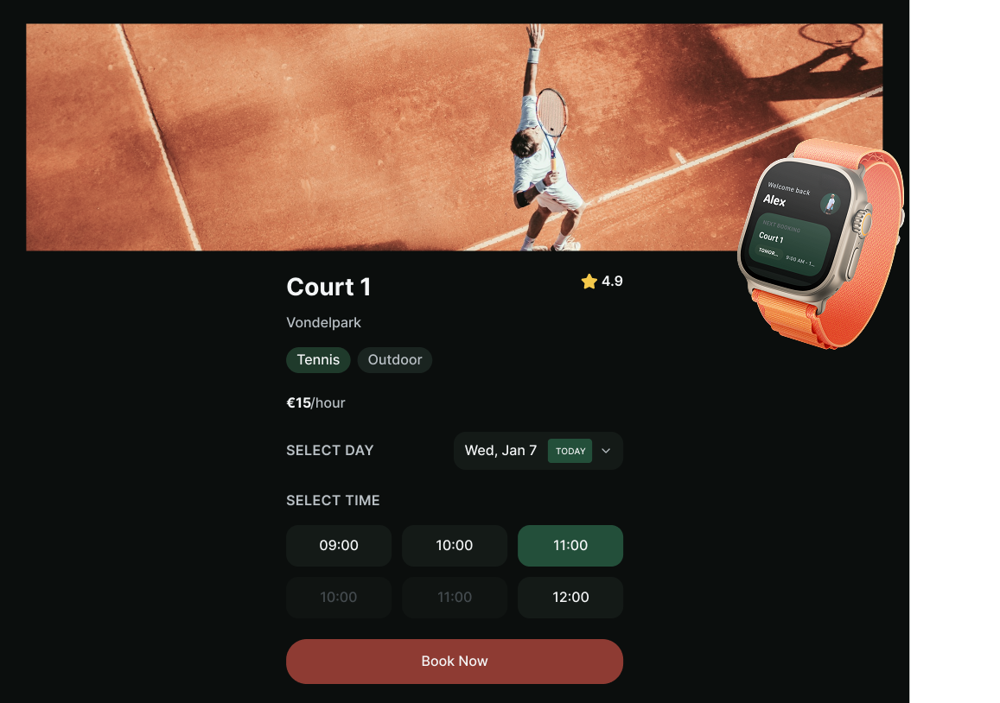

# ReServeApp

ReServeApp grew out of a real tennis booking experience and the idea that reserving a court should feel clear fast and calm. The project explores a polished booking flow on iPhone paired with a lightweight Apple Watch companion for quick confirmation and next booking visibility. It brings together product thinking interface design and SwiftUI implementation in one focused demo. 🎾

Live prototype: [reserve.figma.site](https://reserve.figma.site/)

The current project focuses on a polished court-booking flow on iPhone, plus a compact watch companion that mirrors the next booking and booking confirmation state.

## What is in the repo

- iPhone app with home, court detail, and booking confirmation flows
- Apple Watch companion with responsive watch-sized UI
- Shared booking state and WatchConnectivity sync layer
- Design-system driven styling and placeholder app icons for demo use

## Current demo flow

1. Browse nearby courts on iPhone
2. Open a court and select day and time
3. Confirm the booking
4. Return to the home screen with the latest booking surfaced
5. Mirror that booking on Apple Watch

## Project structure

- `/ReServeApp` - iPhone app assets
- `/reserveappwatch Watch App` - Apple Watch app
- `/BookingManager.swift` - shared booking state
- `/ReserveSyncCoordinator.swift` - iPhone/watch sync
- `/ReserveDesign.swift` - shared design tokens

## Running the app

1. Open `ReServeApp.xcodeproj`
2. Run the `ReServeApp` scheme on an iPhone simulator
3. Run the `reserveappwatch Watch App` scheme on a paired watch simulator

## Notes

- The watch experience is intentionally simplified for demo use
- Search currently lives on iPhone; watch stays focused on mirrored booking state
- Placeholder icons are included and can be replaced later with final brand assets
